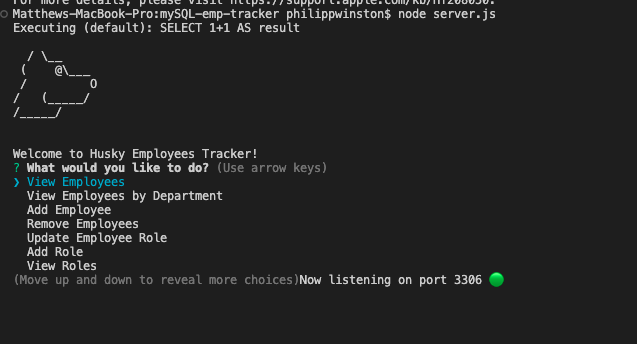

# MYSQL Employee tracker
  
  
## [License](#license)

No license was used for this project.

  ## [Description](#table-of-contents)
  
  As an employer, I would like to be able to track and manage my employees, including but not limited to monitoring budgets, updating rules, and removing employees were needed. This program will allow people who aren't tech savvy to function in a job in HR or upper management
  
  
  ## Table of Contents
  
  - [Description](#discription)
  - [Installation](#installation)
  - [Usage](#usage)
  - [Credits](#credits)
  
  - [Tests](#tests)
  - [License](#license)
  - [Questions](#questions)
  
  ## [Installation](#table-of-contents)
  
  After cloning the repository into your local directory, open it in your markdown editor of choice and in the terminal run `npm I` this will install all of the dependencies needed. Next you will need to copy the .env example in the route directories and name it `.env`, fill out the username and password of your choice and then run in the terminal `mysql -u -p` with your credentials. Next you’ll run `source mySQL/schema.sql;` to initialize the database and then `source mySQL/seeds.sql;` to populate it with data. Then `quit` out of mySQL.
    
  ## [Usage](#table-of-contents)
  
  run `Node server.js` in the terminal and follow the inquirer prompts to navigate, use the arrow keys.

  Check out the install and usage video [Here](https://drive.google.com/file/d/1flPYYWJQZDzFPgJFXjSGPDJRmKb1qyAy/view).

  
  ## [credits](#table-of-contents)
  
  N/A
  

  Thank you for your interest in helping out; however, I will not be accepting contributions from third parties.
  

  

  ## [Tests](#table-of-contents)

  N/A

  ## [Questions](#table-of-contents)

  Please contact me using the following links:
  [GitHub](https://github.com/philippwinston)
  [Email: philippwinston@gmail.com](mailto:philippwinston@gmail.com)
  
---
